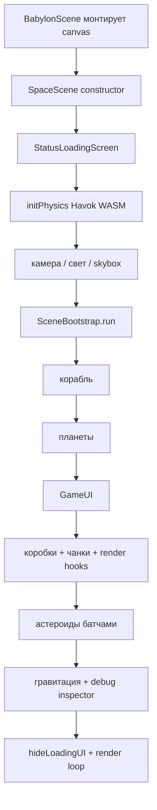

# Galactic Delivery — обзор проекта

Космическая 3D-игра на **React + Vite + Babylon.js + Havok Physics**. Игрок управляет кораблём в бесконечном (чанковом) космосе, собирает грузы и может настраивать параметры полёта в реальном времени.

Связанный документ по дереву файлов и терминам: [project-structure.md](./project-structure.md).

---

## Стек

| Слой | Технологии |
|------|------------|
| UI-оболочка | React 19, Vite 6, TypeScript |
| 3D | `@babylonjs/core`, loaders, materials, inspector |
| Физика | `@babylonjs/havok` (WASM) |
| Игровой UI | `@babylonjs/gui` (AdvancedDynamicTexture) |

React почти не участвует в геймплее: `App` → `BabylonScene` (canvas) → `SpaceScene`. Вся логика мира живёт в `src/babylon/`.

---

## Что уже сделано

### Мир и сцена

- Полноэкранная 3D-сцена с skybox (cube texture), освещением и нулевой гравитацией мира Havok.
- **Чанковая генерация планет**: вокруг корабля подгружаются чанки (~3000 ед.), дальние выгружаются.
- Планеты со сферой-атмосферой, текстурами (mars / jupiter / neptune и др.) и **общим кэшем** diffuse + shared bump — без повторной загрузки одних и тех же файлов.
- **~8000 астероидов** через thin instances + физические сферы; создание батчами по 200 с `requestAnimationFrame`, чтобы не заморозить вкладку.
- Мягкое **притяжение** корабля к ближайшим планетам (импульс в радиусе ~200).
- Опциональный эффект частиц «туманности» за кораблём (зависит от скорости).

### Корабль и управление

- Загрузка модели `public/model/car.glb`, merge мешей, физическое тело (BOX, mass 10).
- Управление с клавиатуры (`KeyboardController` → `IInputState`):
  - **W/S** — тяга вперёд/назад
  - **A/D** — рысканье (yaw)
  - **Стрелки** — тангаж и крен
  - **R** — сброс позиции и скоростей
- Движение через `SpaceShipMovementController`: тяга с разгоном к целевой скорости, вращение по осям корабля, clamp по `maxSpeed`, damping на физическом теле.
- Заготовки **геймпада** (`GamepadInputProvider`) и **композитного ввода** (`CompositeInputProvider`) — код есть, в рантайме пока не подключены (закомментированы в `spaceShip.ts`).
- Черновик **CameraManager** (3rd / 1st person, LERP/SLERP follow) — класс готов, полноценная интеграция в сцену ещё не завершена (сцена исторически опиралась на `ArcRotateCamera`).

### Геймплей «доставка»

- Генерация ~100 светящихся коробок в пространстве.
- Подбор по дистанции (`collectDistance ≈ 10`): коробка удаляется, счётчик растёт, появляется новая вдали от корабля.
- Сообщение «Вы молодец!» при счёте **3** (цель пока захардкожена, UI показывает `Собрано: N / 3`).

### UI

- Счётчик сбора, кнопка «Подсказка» с оверлеем управления.
- Меню **«⚙ Настройки»** со слайдерами полёта (изменения сразу идут в корабль).
- Общие стили в `GuiStyles.ts`.

### Загрузка

- Кастомный `StatusLoadingScreen` с брендом и текстом текущего этапа.
- Оркестратор `SceneBootstrap`: физика → камера/skybox → корабль → планеты → UI → грузы → астероиды (с прогрессом) → гравитация → опциональный Inspector.
- Inspector только при `?debug=1` или `localStorage.debugInspector = "1"`.

### Настройки полёта (live)

| Параметр | По умолчанию | Смысл |
|----------|--------------|--------|
| `maxSpeed` | 100 | Потолок скорости |
| `thrustAcceleration` | 20 | Скорость набора тяги |
| `rotationSpeed` | 0.5 | Скорость поворотов |
| `linearDamping` | 0.95 | Линейное торможение |
| `angularDamping` | 0.8 | Угловое торможение |

---

## Как это работает

### Поток запуска



### Слои ответственности

```
React (оболочка)
  └── SpaceScene          — мир, чанки, грузы, гравитация, цикл
        ├── SceneBootstrap      — порядок старта + статусы
        ├── SpaceShip           — модель + физика + настройки
        │     └── MovementController  — тяга/поворот каждый кадр физики
        ├── KeyboardController  — состояние клавиш → IInputState
        ├── AsteroidsController — thin instances + physics
        └── GameUI / FlightSettingsMenu — ADT поверх canvas
```

### Движение корабля (каждый кадр физики)

1. `KeyboardController.getState()` даёт `thrust / yaw / pitch / roll` в диапазоне примерно −1…1.
2. `SpaceShipMovementController` на `onBeforePhysicsObservable`:
   - разгоняет продольную скорость к `thrust * maxSpeed` с шагом `thrustAcceleration * dt`;
   - задаёт угловую скорость по локальным осям корабля;
   - обрезает суммарную скорость по `maxSpeed`.
3. Havok применяет `linearDamping` / `angularDamping` — корабль «сам» замедляется при отпускании клавиш.

### Настройки UI → физика

Слайдер → `GameUI` callback → `SpaceShip.updateFlightSettings()` → `MovementController.applyConfig()` + при необходимости `body.setLinearDamping` / `setAngularDamping`. Следующий кадр уже с новыми числами.

### Чанки планет

- Сетка по `chunkSize`; ключ чанка — строка `"x_y_z"`.
- При смещении корабля дальше `chunkUpdateThreshold` генерируются недостающие чанки в радиусе `generationDistance`.
- Далекие чанки удаляются (`dispose` мешей планет и детей-атмосфер).

### Сбор грузов

Каждый кадр в `registerBeforeRender`: проверка `DistanceSquared` корабль–коробка; при попадании — dispose, `score++`, UI, при `score === 3` — сообщение победы, иначе спавн новой коробки.

---

## Карта ключевых файлов

| Файл | Роль |
|------|------|
| `src/BabylonScene.tsx` | React-обёртка canvas, resize |
| `src/babylon/scenes/SpaceScene.ts` | Главный оркестратор мира (~700 строк) |
| `src/babylon/scenes/SceneBootstrap.ts` | Последовательность загрузки |
| `src/babylon/loading/StatusLoadingScreen.ts` | Overlay загрузки |
| `src/babylon/scenes/spaceships/spaceShip.ts` | Корабль |
| `src/babylon/scenes/spaceships/spaceShipMovementController.ts` | Физика полёта |
| `src/babylon/scenes/spaceships/KeyboardController.ts` | Клавиатура |
| `src/babylon/scenes/spaceships/GamepadInputProvider.ts` | Геймпад (готово, не подключено) |
| `src/babylon/scenes/spaceships/CompositeInputProvider.ts` | Сумма вводов |
| `src/babylon/scenes/spaceships/CameraManager.ts` | Follow-камера (готово, интеграция частичная) |
| `src/babylon/scenes/spaceships/FlightSettingsConfig.ts` | Тип и дефолты настроек |
| `src/babylon/asteroidsController.ts` | Поле астероидов |
| `src/babylon/gui/GameUI.ts` | HUD |
| `src/babylon/gui/FlightSettingsMenu.ts` | Меню слайдеров |

Ассеты: `public/model/`, `public/textures/`, `public/havok/HavokPhysics.wasm`.

---

## Что можно сделать и улучшить

### Критично / стабильность

1. **Довести интеграцию камеры** — согласовать `CameraManager` со сценой (сейчас в `SpaceScene` остаются следы `ArcRotateCamera` и вызовы до создания корабля). Follow-камера должна обновляться в render/physics loop с актуальным `IInputState`.
2. **Починить порядок инициализации** в `createCamera` / `initGameUI`: камера не должна зависеть от `ship` до `CreateShip`.
3. **Убрать мёртвый код**: `spaceShipMoveControllerOLD.ts`, `spaceShipMoveControllerImproved.ts`, неиспользуемые `createMesh` / `createScene` / `createSphere`, дубли skybox vs `SpaceSkyboxService`.
4. **Корректный dispose** при выгрузке чанков и астероидов: физические `PhysicsAggregate` / shapes, материалы, observers — иначе утечки и падение FPS.

### Геймплей и UX

5. Связать **цель миссии** с UI: сейчас `boxCount = 100`, а победа и надпись — при **3**; вынести `targetScore` в конфиг.
6. **Блокировать управление**, пока открыты настройки или подсказка (и/или пауза физики).
7. **Сохранять** `FlightSettings` в `localStorage`.
8. Подключить **геймпад** через `CompositeInputProvider` и описать раскладку в «Подсказке».
9. Переключение **1st / 3rd person** (кнопка или клавиша) на базе уже написанного `CameraManager`.
10. Звук двигателя / подбора / победы; минимальный tutorial на первом запуске.

### Производительность

11. Физика астероидов **только рядом с кораблём** (или spatial hash / отложенная активация) — 8000 static aggregates тяжелы на старте и в runtime.
12. LOD / меньше сегментов у далёких планет; инстансинг или упрощённые атмосферы.
13. Не создавать новые линии гравитации каждый кадр там, где уже есть `instance` update (проверить визуализацию `appyGravity`).
14. Ленивая подгрузка тяжёлых 4k-текстур; сжатые форматы (basis/ktx2) при необходимости.

### Архитектура

15. Разбить **монолитный `SpaceScene.ts`** на сервисы: `PlanetChunkService`, `CargoService`, `GravityService`, `SkyboxService` (частично уже задумано в docs).
16. Единый интерфейс `IInputProvider` для клавиатуры (сейчас `getState` vs `getInput` у геймпада) — один контракт.
17. Конфиг мира (`chunkSize`, `asteroidsCount`, `boxCount`, силы гравитации) в одном JSON/TS-модуле.
18. Нормальный **dispose сцены** при размонтировании React (`engine.dispose`), чтобы HMR/навигация не плодили движки.
19. Типизация вместо `any` у Havok instance; исправить опечатку `appyGravity` → `applyGravity`.

### Контент и продукт

20. Настоящая модель корабля вместо `car.glb`; точки спавна / «станции доставки» с зоной сдачи груза.
21. Простая миссия: маршрут A→B, таймер, препятствия.
22. Меню старта / пауза / рестарт миссии поверх ADT или лёгкого React-оверлея.
23. README проекта (сейчас шаблон Vite) — как запустить, управление, debug-флаги.

### Качество кода

24. ESLint на неиспользуемые импорты; единый стиль отступов в `SpaceScene`.
25. Юнит-тесты на чистую логику: merge настроек, clamp скорости, ключи чанков.
26. Не плодить `console.log` в проде (`spaceShipNode`, complete и т.п.).

---

## Краткий вердикт

Проект уже даёт играбельный прототип: физический полёт, большой мир с чанками и астероидами, сбор грузов и live-тюнинг управления. Сильные стороны — загрузка со статусами, кэш текстур, батчи астероидов и разделение UI/настроек полёта. Главный техдолг — **монолит сцены**, **незавершённая камера/геймпад**, **стоимость физики тысяч астероидов** и приведение геймплейных констант (цель «3 из 100») к осмысленной миссии.

Приоритетный порядок работ: стабилизировать камеру и init → подключить ввод/паузу меню → вынести сервисы из `SpaceScene` → оптимизировать астероиды → оформить миссию и README.
