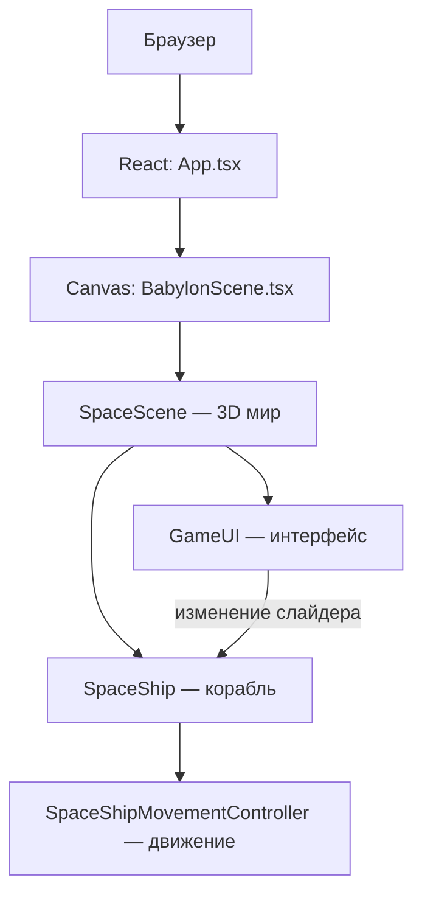
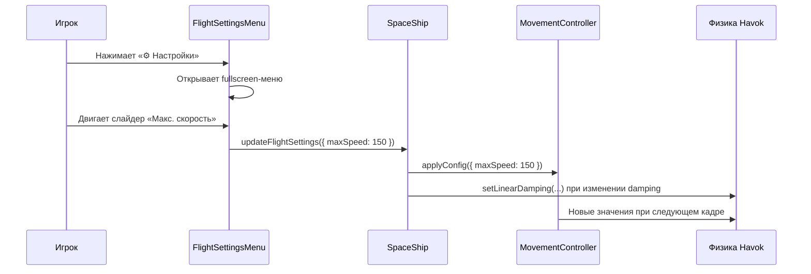

# Структура проекта GalacticDelivery

Простое описание того, из чего состоит проект, как связаны части и как работают настройки полёта космолёта.

---

## Дерево файлов

```
GalacticDelivery/
├── index.html                 # HTML-страница, точка входа в браузере
├── docs/
│   └── project-structure.md   # Этот файл
└── src/
    ├── main.tsx               # Запускает React-приложение
    ├── App.tsx                # Корневой React-компонент (только canvas)
    ├── App.css                # Базовые стили страницы (100% экрана)
    ├── BabylonScene.tsx       # React-обёртка для 3D-canvas
    │
    └── babylon/               # Вся игровая логика на Babylon.js
        ├── loading/
        │   └── StatusLoadingScreen.ts # Загрузочный экран со статусом этапов
        ├── gui/               # Интерфейс поверх 3D-сцены
        │   ├── GameUI.ts              # Главный UI: счёт, подсказка, настройки
        │   ├── FlightSettingsMenu.ts  # Кнопка и fullscreen-меню настроек полёта
        │   └── GuiStyles.ts           # Общие цвета и размеры UI
        │
        ├── asteroidsController.ts     # Астероиды (создание батчами)
        ├── planetController.ts        # Контроллер планет (вспомогательный)
        │
        └── scenes/
            ├── SpaceScene.ts          # Главная сцена: мир, физика, камера, UI
            ├── SceneBootstrap.ts      # Оркестратор стартовой загрузки
            ├── SpaceSkyboxService.ts  # Небо и фон
            │
            └── spaceships/
                ├── FlightSettingsConfig.ts      # Тип и значения настроек полёта
                ├── spaceShip.ts                 # Корабль: модель, физика, настройки
                ├── spaceShipMovementController.ts # Логика движения корабля
                ├── KeyboardController.ts        # Ввод с клавиатуры (WASD, стрелки)
                └── IInputState.ts               # Формат данных ввода
```

---

## Как устроены слои приложения



1. **React** — только оболочка: показывает canvas на весь экран. Настроек в HTML больше нет.
2. **BabylonScene** — создаёт `SpaceScene` при монтировании canvas.
3. **SpaceScene** — строит мир (планеты, коробки, физику, камеру) и подключает `GameUI`.
4. **GameUI** — рисует кнопки и текст поверх 3D-сцены.
5. **SpaceShip** — загружает модель корабля и управляет его физикой.
6. **SpaceShipMovementController** — каждый кадр применяет тягу и вращение по настройкам.

---

## Как работает UI настроек



### Что на экране

| Элемент | Где | Что делает |
|---------|-----|------------|
| Счёт «Собрано: 0 / 3» | Слева сверху | Показывает прогресс сбора коробок |
| «Подсказка» | Справа сверху (левее настроек) | Открывает окно с управлением |
| «⚙ Настройки» | Справа сверху | Открывает fullscreen-меню полёта |

---

## Настройки полёта

Все параметры хранятся в `FlightSettingsConfig` и применяются в реальном времени.

| Параметр | По умолчанию | На что влияет |
|----------|--------------|---------------|
| **maxSpeed** | 100 | Максимальная скорость корабля (W/S) |
| **thrustAcceleration** | 20 | Как быстро набирается скорость |
| **rotationSpeed** | 0.5 | Скорость поворота (A/D и стрелки) |
| **linearDamping** | 0.95 | Как быстро корабль замедляется при отпускании W/S |
| **angularDamping** | 0.8 | Как быстро останавливается вращение |

Чем выше **linearDamping** и **angularDamping** (ближе к 0.99), тем сильнее «торможение» при отпускании клавиш.

---

## Управление кораблём

| Клавиша | Действие |
|---------|----------|
| W / S | Вперёд / назад |
| A / D | Поворот влево / вправо (рысканье) |
| Стрелки | Наклон и крен |
| R | Сброс позиции и скорости |

Ввод обрабатывает `KeyboardController`, движение — `SpaceShipMovementController`.

---

## Словарь терминов

### AdvancedDynamicTexture (ADT)

**Простыми словами:** прозрачный слой интерфейса поверх 3D-сцены — как плёнка с кнопками, текстом и слайдерами, нарисованная прямо на canvas.

**Где используется:** один ADT на всю сцену создаётся в `SpaceScene`, все элементы UI (`GameUI`, `FlightSettingsMenu`) добавляются в него.

---

### PhysicsAggregate

**Простыми словами:** «физическое тело» объекта в игре. Связывает 3D-модель (mesh) с движком физики Havok — масса, скорость, столкновения.

**Где используется:** у корабля (`spaceShip.ts`), планет и других объектов в `SpaceScene.ts`.

---

### Damping (линейное / угловое торможение)

**Простыми словами:** насколько быстро объект замедляется сам по себе, когда ты отпускаешь клавиши. Без damping корабль бы «скользил» в космосе почти без остановки.

- **linearDamping** — торможение двиения вперёд/назад
- **angularDamping** — торможение вращения

---

### Havok Physics

**Простыми словами:** движок физики, который считает столкновения, гравитацию и движение тел. Babylon.js подключает его через плагин `HavokPlugin`.

---

### IInputState

**Простыми словами:** набор чисел «что нажато на клавиатуре»: тяга (-1, 0, 1), повороты по трём осям. Контроллер движения читает это каждый кадр.

---

### StackPanel / Slider / Rectangle (Babylon GUI)

**Простыми словами:** строительные блоки интерфейса Babylon:
- **Rectangle** — прямоугольник (фон, панель, overlay)
- **Slider** — ползунок для числовых настроек
- **StackPanel** — контейнер, который складывает элементы друг под другом (или в ряд)

---

## Ключевые связи между файлами

```
FlightSettingsConfig.ts
    ↓ (тип + дефолты)
spaceShipMovementController.ts  ← хранит config, применяет при движении
    ↑
spaceShip.ts  ← updateFlightSettings() / getFlightSettings()
    ↑
SpaceScene.ts  ← передаёт callbacks в GameUI
    ↓
GameUI.ts → FlightSettingsMenu.ts  ← слайдеры вызывают onSettingsChange
```

---

## Загрузка сцены

При старте показывается полноэкранный overlay (`StatusLoadingScreen`) с текстом текущего этапа.

### Этапы

1. Инициализация физики (Havok WASM)
2. Подготовка камеры и космоса (skybox)
3. Загрузка корабля (модель `car.glb`)
4. Генерация планет (без дублей, с общим кэшем текстур)
5. Интерфейс (GameUI)
6. Размещение грузов
7. Астероиды батчами по 200 штук — статус вида `Астероиды: 400 / 8000`
8. Готово — overlay скрывается, начинается render loop

Оркестратор: `SceneBootstrap.ts`. Он вызывает шаги по порядку и обновляет текст на экране.

### Почему так сделано

- Раньше `createLocation` запускался без await, а render loop крутился сразу — пользователь видел пустой canvas.
- 8000 астероидов создавались одним синхронным циклом и «замораживали» вкладку. Теперь между батчами есть `requestAnimationFrame`, и статус обновляется.
- Текстуры планет шарятся (одна bump 4k на все планеты + кэш diffuse), чтобы не грузить один и тот же файл десятки раз.
- Babylon Inspector открывается только с `?debug=1` или `localStorage.debugInspector = "1"`.

### Сноска: ILoadingScreen

**Простыми словами:** договорённость Babylon.js для своего загрузочного экрана. Движок вызывает `displayLoadingUI` / `hideLoadingUI`, а текст статуса пишется в `loadingUIText`.

---

## Что можно улучшить дальше

- Сохранение настроек в `localStorage`, чтобы они не сбрасывались после перезагрузки
- Блокировка управления кораблём, пока открыто меню настроек
- Перенос inline-логики планет и чанков из `SpaceScene.ts` в отдельные сервисы
- Физика астероидов только рядом с кораблём (ещё быстрее старт)
